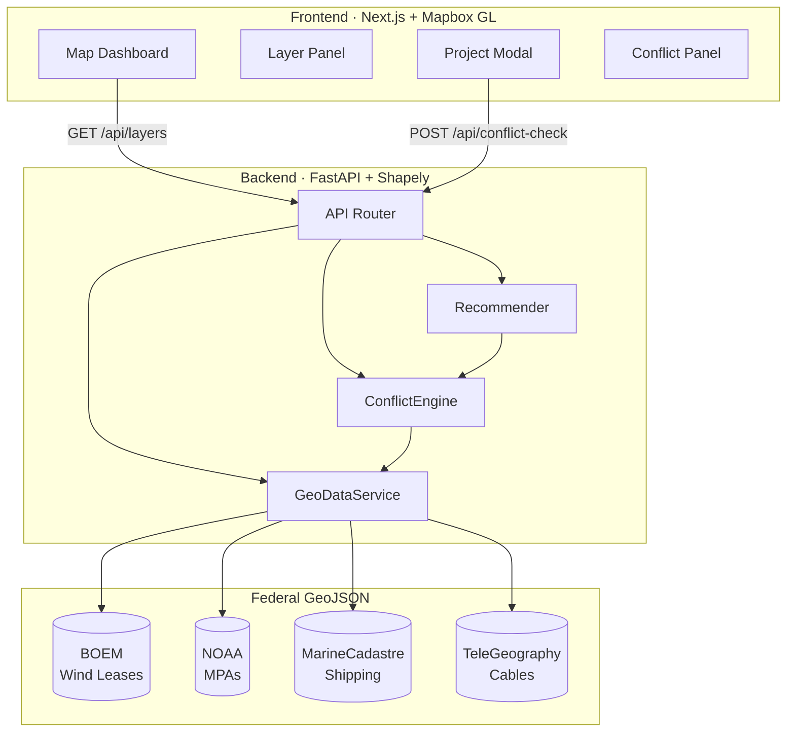

# BlueRegistry

**Spatial Intelligence for the Blue Economy**

BlueRegistry is an interactive ocean planning tool that lets users propose offshore projects—wind farms, aquaculture sites, subsea cables—and instantly analyze spatial conflicts against real federal datasets. Drop a pin, set a radius, and get a risk score with actionable relocation recommendations.

## Demo Flow

1. **Explore** — Full-screen dark ocean map with toggleable federal data layers (wind leases, MPAs, shipping lanes, submarine cables)
2. **Propose** — Click anywhere to drop a project pin, choose a type, and set a radius
3. **Analyze** — Conflict engine scores risk 0–100, flags overlapping protected zones and shipping corridors
4. **Optimize** — AI recommender suggests lower-risk locations and flies the map to the new site

## Architecture

| Layer        | Stack                                        | Role                                                                                                                |
| ------------ | -------------------------------------------- | ------------------------------------------------------------------------------------------------------------------- |
| **Frontend** | Next.js · React · Mapbox GL JS · Tailwind    | Dark-themed map dashboard with glassmorphism panels, real-time layer rendering, and animated conflict visualization |
| **Accounts** | Convex                                       | Email/password account auth and per-user persisted project lists                                                      |
| **Backend**  | FastAPI · Shapely · Python                   | GeoJSON ingestion, spatial overlap/buffer analysis, risk scoring, and grid-search relocation engine                 |
| **Data**     | BOEM · NOAA · MarineCadastre · TeleGeography | Real federal GeoJSON datasets for wind leases, marine protected areas, shipping lanes, and submarine cables         |



## Key Endpoints

```
GET  /health              → service status + loaded layer counts
GET  /api/layers           → all GeoJSON layers for map rendering
POST /api/conflict-check   → spatial analysis with risk score + recommendation
```

## Quickstart

```bash
# Backend
cd backend
uv sync
uv run uvicorn app.main:app --port 8000

# Frontend
cd frontend
bun install
bun run convex:dev  # in another terminal (first run will set up your Convex deployment)
bun run dev
```

Required frontend env vars:

- `NEXT_PUBLIC_MAPBOX_TOKEN`
- `NEXT_PUBLIC_CONVEX_URL` (from Convex dashboard / `convex dev`)

## Team

Built by **Krish** (backend + AI) and **Partner** (frontend + UX).
